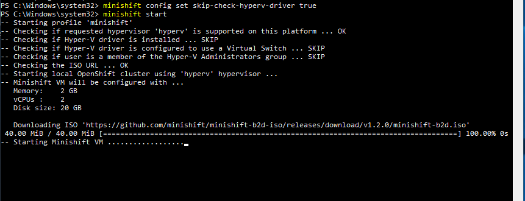
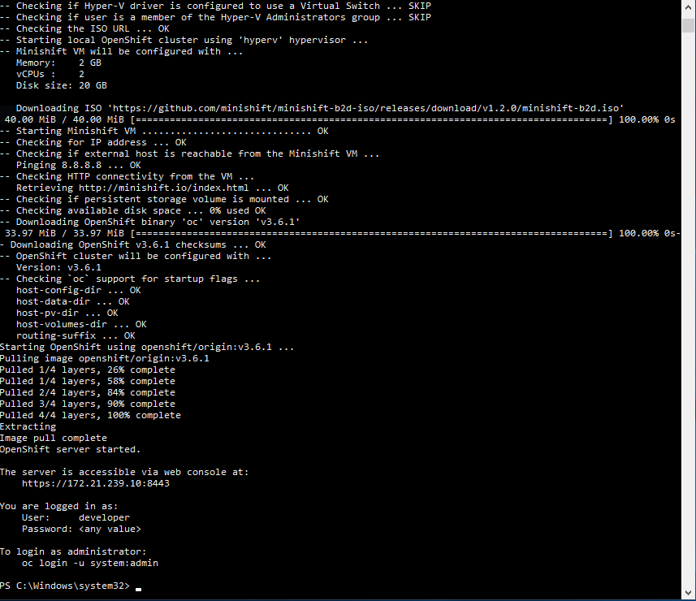
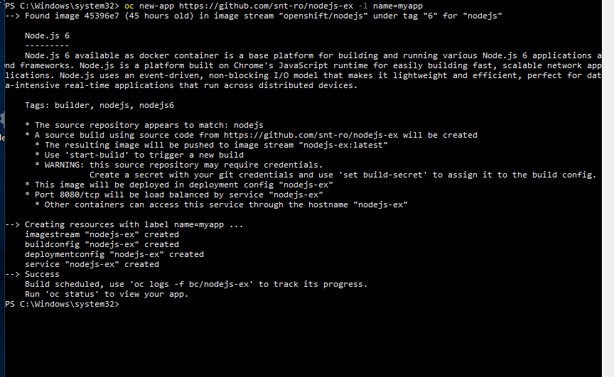

 
# Openshift on Windows 10

## Introductory readings
Great resources on [http://budhram.in/writing/2017/06/06/minishift-in-windows/](http://budhram.in/writing/2017/06/06/minishift-in-windows/)

### Instant reload
Read on [https://github.com/nearform/minishift-demo](https://github.com/nearform/minishift-demo)

### Minishift hostfolder
[https://gist.github.com/gbraad/c66c7f00c101e34f8d7db2b2cbe9b943](https://gist.github.com/gbraad/c66c7f00c101e34f8d7db2b2cbe9b943)

## Create a new test project

```Powershell
$env:HYPERV_VIRTUAL_SWITCH="Default Switch"
cinst minishift
minishift config set skip-check-hyperv-driver true
minishift start --iso-url file://C:/kituri/centos/v1.7.0/minishift-centos.iso --memory 8192
& minishift oc-env | Invoke-Expression
oc.exe version
oc new-app https://github.com/snt-ro/nodejs-ex -l name=myapp
oc logs -f bc/nodejs-ex
oc expose svc/nodejs-ex
minishift openshift service nodejs-ex -n myproject 
```

## Delete a project
```Powershell
oc get projects
oc delete all --all
oc delete project myproject
oc get projects
```


## From Cygwin

```bash
minishift start
minishift oc-env
oc login https://172.21.239.10:8443 --token=zUoqtwJVr_K2fK5l2Rlk6ZMrb6vAVFCR7CCrNmKhhjY  
```


## admin 
```bash
minishift addons install --defaults
minishift addons enable admin-user
minishift start
```

## Screenshots





## Eclipse org testbed

```bash
oc new-project redhat-iot --display-name="Eclipse IoT Asset Tracking Testbed"
oc policy add-role-to-user view system:serviceaccount:redhat-iot:default -n redhat-iot
```

## Root password
 ssh docker@<docker-machine-ip>
 password: tcuser

## Mount host folders
### Prereq
Enable SMB_SERVERV1.0 in windows features

### Creating and adding a share

```Powershell
net user minishift_user my_randomPWD! /ADD
net share minishift_share=g:\projects\kontron-iot /GRANT:$env:COMPUTERNAME\minishift_user,FULL
minishift hostfolder add minishift_share
#\\10.144.244.191\minishift_share
#Enter
#minishift_user
#my_randomPWD!
#.
```

---
The unc address should be the external address of the windows machine
The last answer, for domain, is dot (.)


---

### Mounting a share
```Powershell
minishift hostfolder mount minishift_share
```


## Mount host volumes rights

```
oc login -u system:admin
oc adm policy add-scc-to-user anyuid system:serviceaccount:$PROJECT:default
oc adm policy add-scc-to-user hostaccess system:serviceaccount:$PROJECT:default
```

## Save/Start minishift VM

```Powershell
Save-Vm 'minishift'
Start-Vm 'minishift'
```


## Centos certificate issue


```
#copy redhat-uep.pem to home folder
mkdir -p /etc/rhsm/ca
cp ~/redhat-uep.pem /etc/rhsm/ca
```