# DevOp Notes and Tools

DevOp Notes and more

- [DevOp Notes and Tools](#devop-notes-and-tools)
  - [Scope](#scope)
  - [Editorconfig](#editorconfig)
    - [Create .editorconfig](#create-editorconfig)
    - [SublimeText](#sublimetext)
  - [Bookmarks](#bookmarks)
  - [Chocolatey](#chocolatey)
    - [Chocolatey Installation](#chocolatey-installation)
      - [Lazy or in hurry developers](#lazy-or-in-hurry-developers)
      - [Rest of you](#rest-of-you)
    - [Usage](#usage)
  - [Cygwin](#cygwin)
    - [Cygwin Installation](#cygwin-installation)
    - [How to use](#how-to-use)
  - [Vagrant](#vagrant)
    - [Vagrant Prerequisites](#vagrant-prerequisites)
    - [Vagrant Installation](#vagrant-installation)
    - [Vagrant Usage](#vagrant-usage)
  - [Packer](#packer)
    - [Packer Installation](#packer-installation)
  - [Docker](#docker)
    - [List containers](#list-containers)
    - [Stop container](#stop-container)
    - [Follow logs](#follow-logs)
    - [Delete images](#delete-images)
    - [Docker 18 Edge](#docker-18-edge)
  - [Gitlab](#gitlab)
    - [Install gitlab-cli on Windows](#install-gitlab-cli-on-windows)
    - [Config file](#config-file)
    - [Generate acces token](#generate-acces-token)
  - [Git](#git)
    - [Where are we](#where-are-we)
    - [Long paths](#long-paths)
    - [Large files](#large-files)
    - [Linefeed](#linefeed)
    - [Understanding branches](#understanding-branches)
    - [Sourcetree](#sourcetree)
      - [Starting a new feature](#starting-a-new-feature)
    - [Gitflow](#gitflow)
  - [Svn](#svn)
    - [Info](#info)
  - [Jenkins](#jenkins)
    - [Jenkins on CentOS7](#jenkins-on-centos7)
  - [WinRM](#winrm)
    - [WinRM Configuration](#winrm-configuration)
    - [Run a script on a remote machine](#run-a-script-on-a-remote-machine)
  - [Versioning](#versioning)
  - [Linux subsystem for Windows](#linux-subsystem-for-windows)
  - [Windows](#windows)
  - [Openshift Origin](#openshift-origin)
    - [Installation guide](#installation-guide)
    - [Login as admin](#login-as-admin)
    - [Run commands as system](#run-commands-as-system)
    - [Integration with GitLab](#integration-with-gitlab)
    - [Increasing memory](#increasing-memory)
  - [Visual studio code - Angular](#visual-studio-code---angular)
    - [Angular CLI using https](#angular-cli-using-https)
    - [Chrome Debugging with Angular CLI](#chrome-debugging-with-angular-cli)
  - [Azure](#azure)
    - [Switch the resource plan profile](#switch-the-resource-plan-profile)
    - [Microsoft Active Directory v2 app registration](#microsoft-active-directory-v2-app-registration)

## Scope

- To have a quick reference on installing/using some nice tools for primary Windows owners

## Editorconfig

### Create .editorconfig

[http://editorconfig.org/](http://editorconfig.org/)

### SublimeText

Add EditorConfig plugin
Tools>Install Package>EditorConfig

## Bookmarks

* [https://github.com/MorganGeek/bookmarks](https://github.com/MorganGeek/bookmarks)
* [Building a Deployment Pipeline for .NET](https://github.com/Kennethtruyers/Todo.Web)
* [This PowerShell module contains cmdlets to query instances of Visual Studio 2017 and newer](https://github.com/Microsoft/vssetup.powershell)

## Chocolatey

### Chocolatey Installation

#### Lazy or in hurry developers

From the folder WindowsTools\Chocolatey, run with administrative privileges install_Chocolatey.bat

#### Rest of you

Goto [https://chocolatey.org/install](https://chocolatey.org/install) and follow the steps

### Usage

* Long version

```bash
choco install mySensationalPackage
```

* Using the alias

```bash
cinst mySensationalPackage
```

## Cygwin

... a large collection of GNU and Open Source tools which provide functionality similar to a Linux distribution on Windows

### Cygwin Installation

1. Open a command prompt in Administrator mode
2. Be sure that [Chocolatey](#chocolatey) is installed. Run the following command

    ```bash
    choco install cyg-get
    ```

    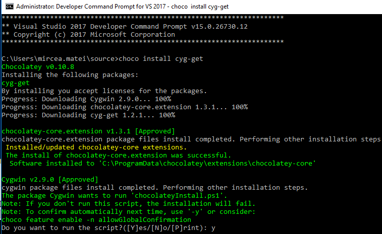

### How to use

1. On Windows search box write Cygwin
    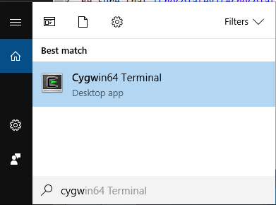
2. A terminal windows must appear as following
    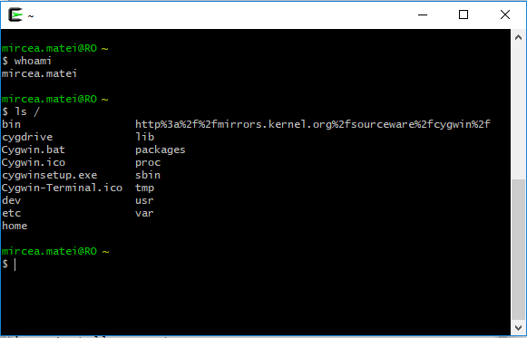
3. The terminal window is opened to a large collection of GNU and Open Source tools

## Vagrant

... enables users to create and configure lightweight, reproducible, and portable development environments

### Vagrant Prerequisites

1. Open a command prompt in Administrator mode
    ```bash
    cyg-get openssh
    cyg-get rsync
    cyg-get ncurses
    ```
2. Install a hypervisor (Hyper-V or VirtualBox). Hyper-V on windows is a feature
    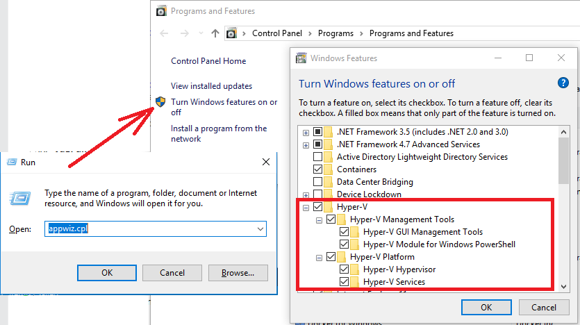
3. If you like VirtualBox or need access to USB from guest VMs, use chocolatey to install

    ```bash
    cinst virtualbox
    ```

### Vagrant Installation

Using chocolatey

```bash
cinst vagrant
```

### Vagrant Usage

A fast and furious howto...

1. Goto [https://app.vagrantup.com/boxes/search?](https://app.vagrantup.com/boxes/search?) and find the box you are looking for. For example, I am looking for CentOs box built for hyperv
    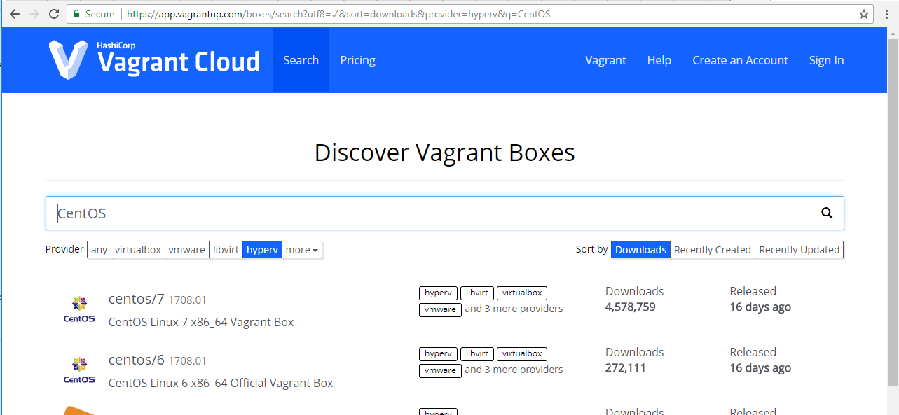
2. Open a Cygwin terminal in administrative mode
3. Count to four and you're done. Assuming that you are new kid on the block and haven't customized vagrant file, just type the following commands in the Cygwin terminal...

    ```bash
      mkdir centos
      cd !$
      vagrant init centos/7
      vagrant up --provider=hyperv
    ```

    If you are virtualbox fun, just switch hyperv with virtualbox in the --provider argument

    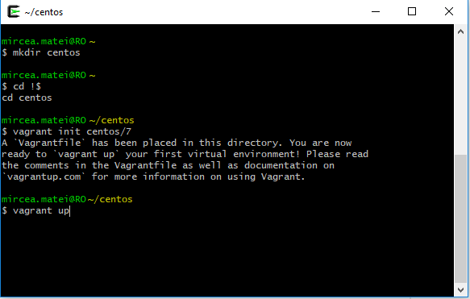

    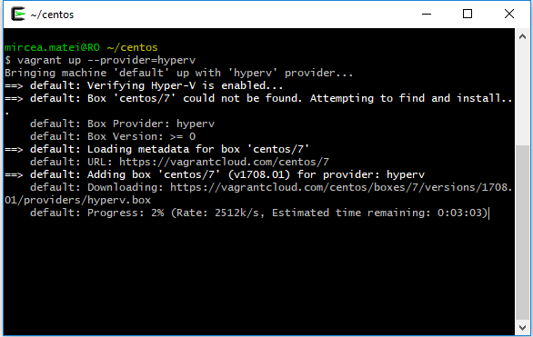

    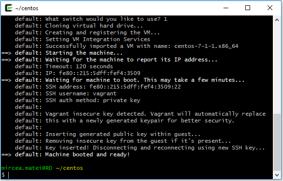

4. Usefull commands
    ```bash
      vagrant status
      vagrant global-status
      vagrant reload
      vagrant halt
      vagrant ssh
      vagrant destroy
    ```

## Packer

... tool that automates the creation of any type of machine image

### Packer Installation

1. Open a command prompt in Administrator mode
2. Be sure that [Chocolatey](#chocolatey) is installed. Run the following command

    ```bash
      cinst packer
    ```

## Docker

### List containers

```bash
docker ps
```

### Stop container

Knowing the name you provided it is easy to stop the container

```bash
docker stop <your-container-name>
```

### Follow logs

```bash
docker logs --tail 1000 <your-container-name>
```

### Delete images

Delete images sourced from the "thereponame"

```PowerShell
&docker images --format "{{.Repository}}:{{.Tag}}" | foreach { $_.split(' ')[0]} | where-object {$_   -Like "thereponame*"} | foreach {docker image rm $_}
```

### Docker 18 Edge

On Windows 10 1709 you may run LCOW containers with the addition of  --platform=linux.

1. Switch to Windows containers
2. All linux containers must be triggered with --platform=linux

## Gitlab

### Install gitlab-cli on Windows

From a powershell console opened as Administrator run:

```bash
Invoke-WebRequest -Uri "https://github.com/clns/gitlab-cli/releases/download/0.3.2/gitlab-cli-Windows-x86_64.exe" -OutFile "gitlab-cli.exe"
move "gitlab-cli.exe" C:\Windows\System32\
```

### Config file

Create a file named .gitlab-cli.yaml in %HOMEPATH% with content as followings.

```yaml
---
repos:
  eng2_new:
    url: http://gitlab.yourdomain.io/mircea.matei/eng2
    token: bp6t2f2fx2M4BACdWGle
  devop4:
    url: http://gitlab.yourdomain.io/mircea.matei/devop4
    token: bp6t2f2fx2M4BACdWGle
```

### Generate acces token

The token will be generated from YourUser=>Settings=>Access Tokens
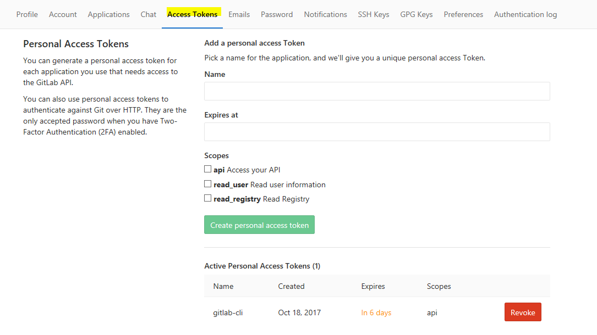

## Git

### Where are we

```bash
git config --list --show-origin
```

### Long paths

```bash
git config --system core.longpaths true
```

### Large files

Find large files commits

```bash
 git rev-list --objects --all | grep "$(git verify-pack -v .git/objects/pack/*. idx | sort -k 3 -n | tail -10 | awk '{print$1}')"
```

### Linefeed

```bash
git config --global core.autocrlf false
git config --global core.eol lf
git rm --cached -rf .
git diff --cached --name-only -z | xargs -n 50 -0 git add -f
cd src/yourlfcleanfolder
git ls-files -z | xargs -0 rm
git checkout .
```

### Understanding branches

A quick [article](http://nvie.com/posts/a-successful-git-branching-model/) that may help you.
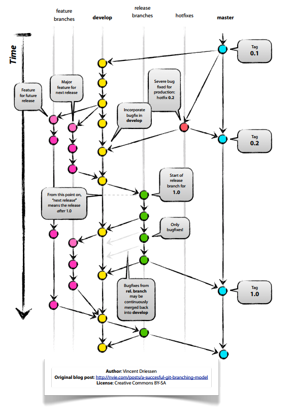

### Sourcetree

Sourcetree is Git GUI for Windows

#### Starting a new feature

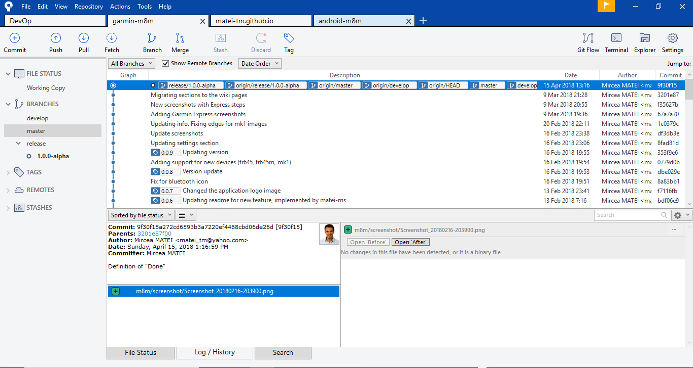
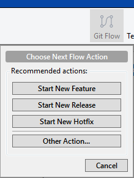
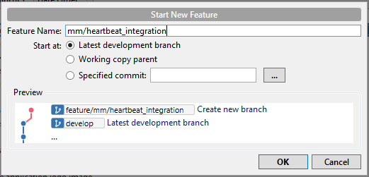

### Gitflow

Plugin to  IntelliJ IDEA for quickly start new Branch/Feature/Patch


## Svn

### Info

Understanding structure [https://svn.apache.org/repos/asf/subversion/trunk/doc/user/svn-best-practices.html](https://svn.apache.org/repos/asf/subversion/trunk/doc/user/svn-best-practices.html)
Sample strategy [https://www.getfilecloud.com/blog/a-svn-branching-strategy-that-works/](https://www.getfilecloud.com/blog/a-svn-branching-strategy-that-works/)

## Jenkins

### Jenkins on CentOS7

Quick installation guide for CentOS is [here](https://www.vultr.com/docs/how-to-install-jenkins-on-centos-7)

## WinRM

### WinRM Configuration

(Powershell) WinRM to configure and WinRS to execute

On the remote target assure that winrm is configured. From a powershell console run:

```bash
winrm quickconfig
```

### Run a script on a remote machine

Place a script on the remote target and call the script remotely from the local machine

```bash
 winrs -r:the_remote_server powershell -file C:\admin_repo\check_status.ps1
```

## Versioning

[Semantic Versioning 2.0.0](https://semver.org/)

## Linux subsystem for Windows

1. Use appwiz.cpl to enable it.
2. Command to pursue
    ```bash
    lxrun /install
    ```

## Windows

If environments was modified in another console

```dos
refreshenv
```

## Openshift Origin

### Installation guide

[https://linoxide.com/linux-how-to/setup-openshift-origin-centos-7/](https://linoxide.com/linux-how-to/setup-openshift-origin-centos-7/)
or using openshift-ansible

### Login as admin

```bash
oc login -u system:admin -n default --config=/etc/origin/master/admin.kubeconfig
```

### Run commands as system

```bash
oc adm policy add-cluster-role-to-user cluster-admin mirceam --config=/etc/origin/master/admin.kubeconfig
```

### Integration with GitLab

Add the followings section to Triggers section of desired BuildConfig

```yaml
    triggers:
    - gitlab:
        secret: 1234f932f43f9d45
      type: GitLab
```

In GitLab go to Settings=>Integration and add a Webhook like the image shows
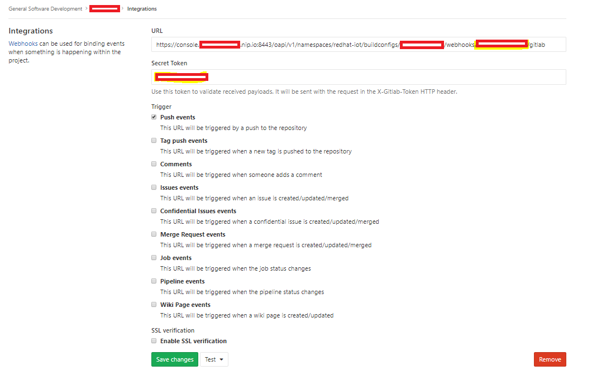

### Increasing memory

```bash
sudo sysctl -w vm.max_map_count=262144
```

## Visual studio code - Angular

### Angular CLI using https

```bash
ng serve --ssl 1 --ssl-key "ssl/yourdomain.io.key" --ssl-cert "ssl/yourdomain.io.crt"
```

### Chrome Debugging with Angular CLI

[article](https://github.com/Microsoft/vscode-recipes/tree/master/Angular-CLI)

```json
{
  "version": "0.2.0",
  "configurations": [
    {
      "name": "ng serve",
      "type": "chrome",
      "request": "launch",
      "url": "http://localhost:4200/#",
      "webRoot": "${workspaceRoot}"
    },
    {
      "name": "ng test",
      "type": "chrome",
      "request": "launch",
      "url": "http://localhost:9876/debug.html",
      "webRoot": "${workspaceRoot}"
    },
    {
      "name": "ng e2e",
      "type": "node",
      "request": "launch",
      "program": "${workspaceRoot}/node_modules/protractor/bin/protractor",
      "protocol": "inspector",
      "args": ["${workspaceRoot}/protractor.conf.js"]
    }
  ]
}
```

## Azure

Azure various notes

### Switch the resource plan profile

```powershell
Login-AzureRmAccount
Set-AzureRmAppServicePlan -ResourceGroupName $YourAzureResourceGroup -Name $YourAzureResourcePlan -Tier Free
```

